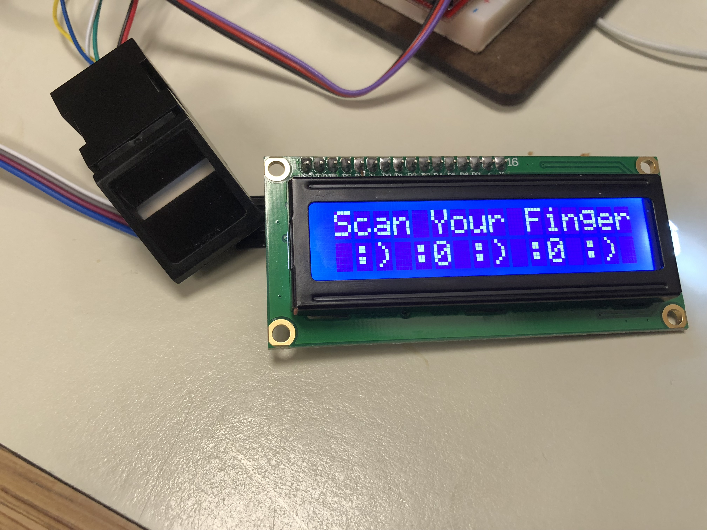
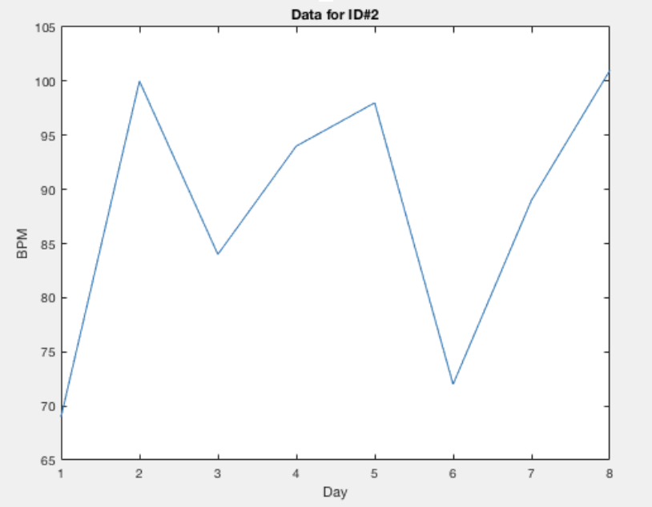
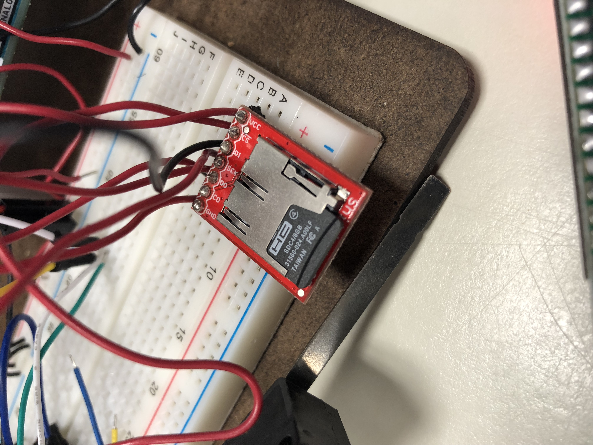
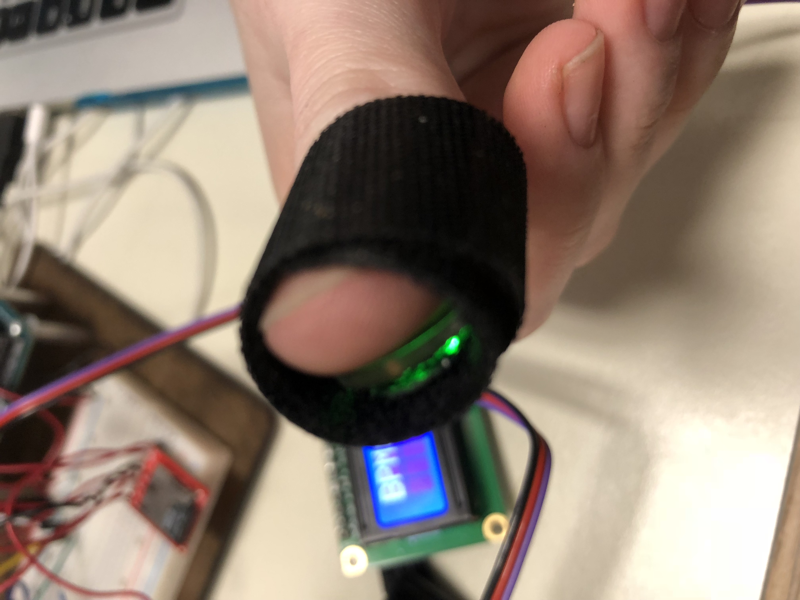

# Health Monitoring Device
A central family monitoring device that stores multiple individual's health data into one place for accessibility. 

## Goals
- Help people with chronic illnesses be able to stay on track with their health
- Create  a central device to store health metrics for an entire family. 
- Be able to see long time trends in health. 
	
### Things I learned
1. Using a Fingerprint sensor to authenticate new users into the system and recognize old users
1. Utilizing an SD card with an arduino Uno to save and retrieve data specific to each user
2. Using the heart beat sensor to take measurements
3. Using the LCD display to output data and instructions
4. Utilizing Matlab to graph data

>  
>
> #### Fingerprint Sensor to authenticate user and LCD Display to walk through the process

>  
>
> #### a graph generated in matlab that shows a specific user's Heart Rate data over the course of a couple days

>  
>
> #### SDcard used to store fingerprint and heart rate data of multiple people

>  
>
> #### heart Rate Sensor

